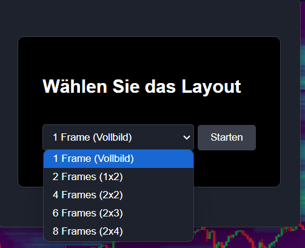
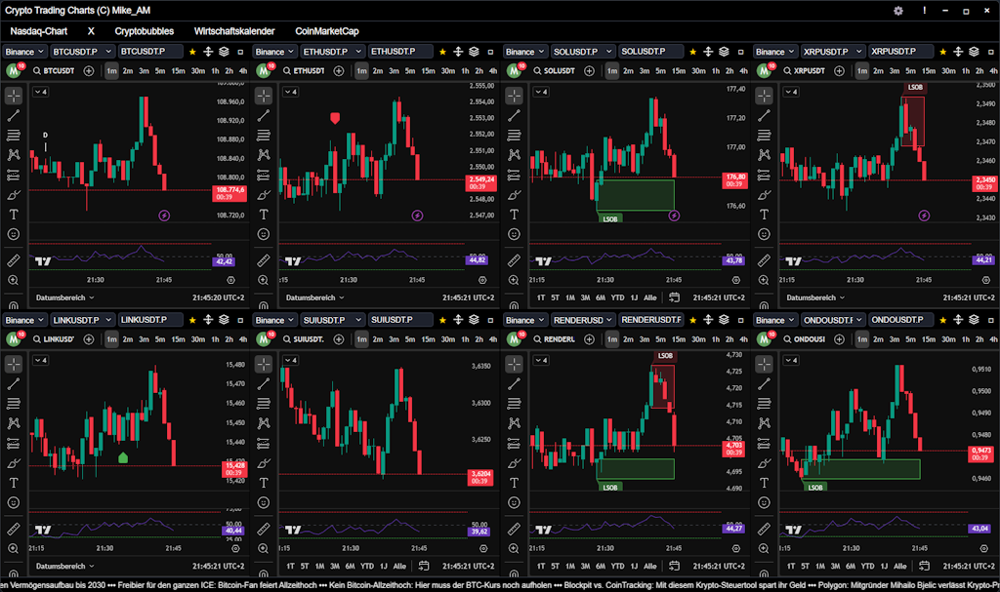
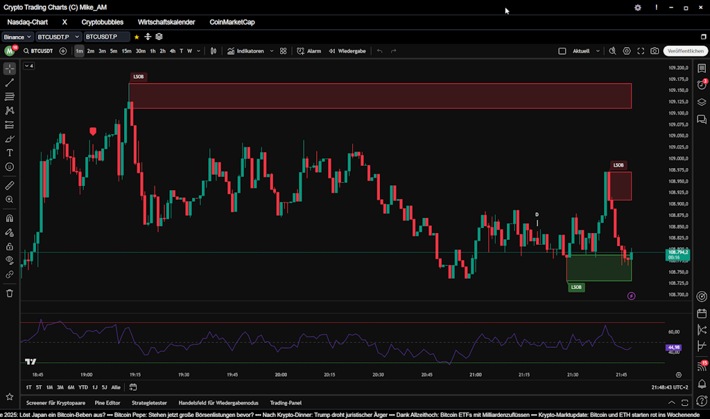
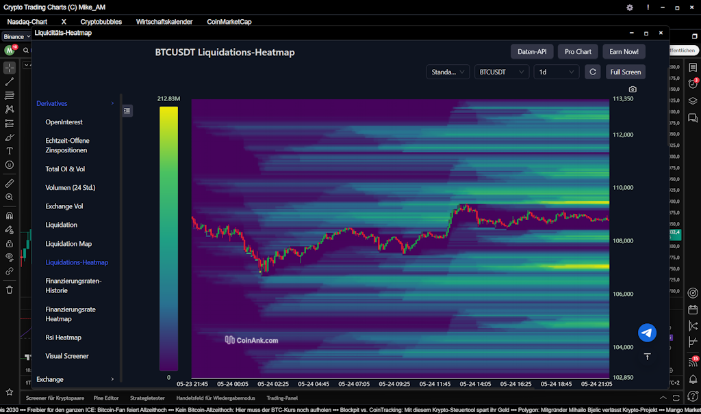
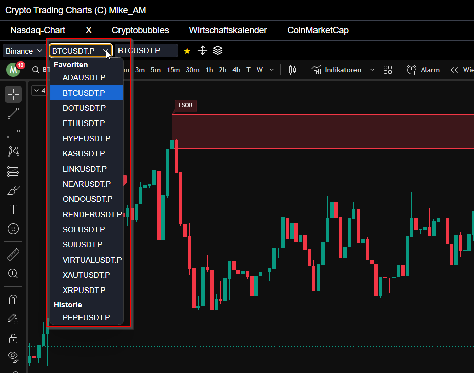
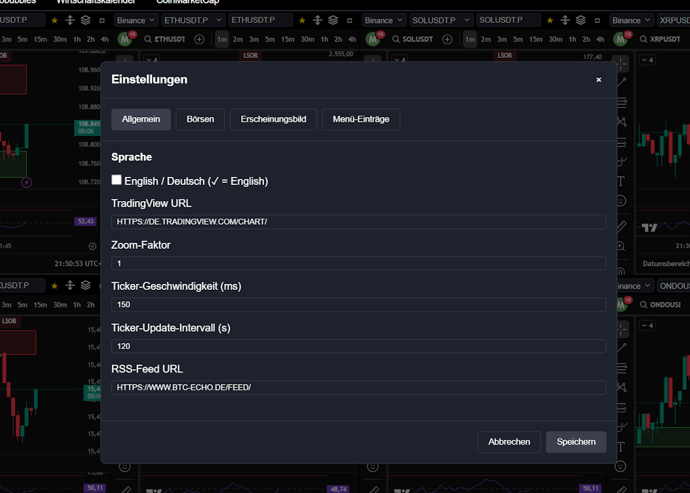

# Crypto Trading Charts

A Windows desktop application for crypto trading with integrated TradingView charts and advanced features.

## Features

- **Multiple Chart View**: Display up to 8 charts simultaneously
- **TradingView Integration**: Direct access to TradingView charts
- **Exchange Support**: 
  - Support for multiple crypto exchanges
  - Easy switching between exchanges
  - Customizable exchange list
- **Symbol Management**:
  - Favorites system
  - Symbol history
  - Quick symbol input
- **Advanced Features**:
  - Liquidity heatmap
  - Futures integration
- **Customization Options**:
  - Dark/Light theme
  - Customizable colors
  - Configurable menu entries
  - Adjustable chart sizes
- **News Ticker**: 
  - RSS feed integration
  - Adjustable speed
  - Automatic updates

## System Requirements

- Windows 10 or higher
- 4GB RAM (recommended)
- Internet connection for chart updates

## Installation

1. Download the latest version from the [Releases](https://github.com/CryptoMikeAM/crypto-trading-charts/releases) section
2. Extract the ZIP file
3. Start the application by double-clicking `crypto-trading-charts.exe`

## Usage

1. **Display Charts**:
   - Select an exchange from the dropdown menu
   - Enter a symbol (e.g., BTCUSDT)
   - Press Enter or select from the list

2. **Manage Favorites**:
   - Click the star button next to the symbol
   - Favorites appear in the dropdown menu

3. **Adjust Chart Size**:
   - Maximize individual charts with the □ button
   - Choose between 1, 2, 4, 6, or 8 charts

4. **Additional Tools**:
   - Liquidity Heatmap: Click the liquidity icon
   - Futures Exchange: Click the exchange icon and you will be redirected to your futures exchange
   - Customizable menu bar - Add links that are visible in the menu bar

## Settings

The application offers extensive customization options:

- **General**:
  - TradingView URL
  - Zoom factor
  - Ticker speed
  - RSS feed URL

- **Exchanges**:
  - Customizable exchange list
  - Futures exchange integration

- **Appearance**:
  - Dark/Light theme
  - Customizable colors
  - Custom menu entries

## Support

For questions or issues:
- Create an issue on GitHub
- Contact us through the provided channels

## Donations

If you like the application, you can support us:
- Bitcoin: bc1qrgtdm4e5duxrqg9uuql7z43m65wat5ncl2j9va
- Ethereum: 0x1233B7DB07d430417D154002baA7745d73D67c35
- Solana: DbyKkiNgyziQiVwbkGz2HTHzijKRHGmYnpActzgGVwFW

## License

This application is open source and released under the MIT license.

## Disclaimer

Use of this application is at your own risk. The developer assumes no liability for damages that may arise from the use of the application. 

------

At startup, they have to select the number of frames

After selecting the frames, the frames are displayed accordingly. When you start it for the first time, you still have to log in to a window in your Tradingview account.

Full screen of the frame

Liquidity headmap

Favorites

Settings

 
